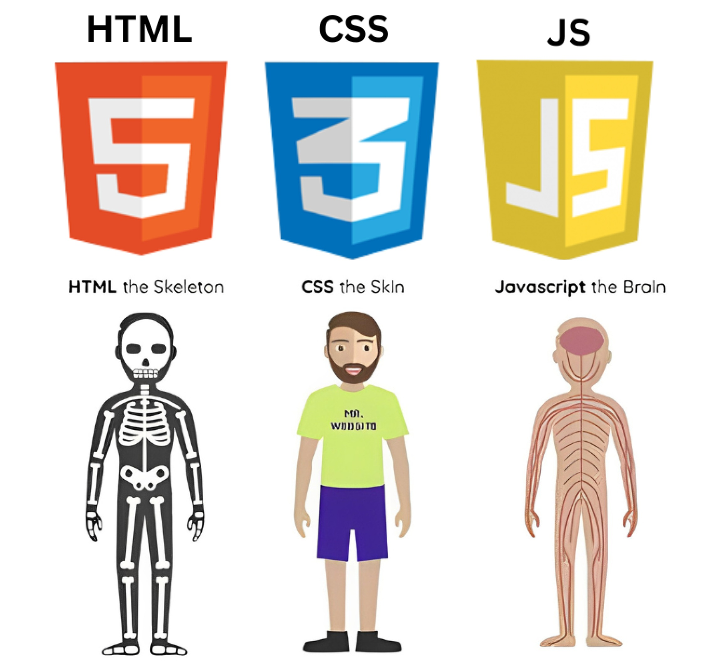
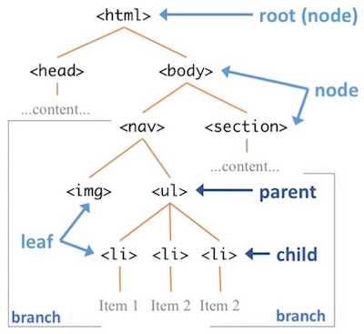

## 1) Что такое HTML

**HTML (HyperText Markup Language)** — язык разметки, который описывает **структуру веб-страницы**.
HTML не программирует, а **описывает**, что и где должно быть: заголовки, абзацы, ссылки, изображения, таблицы, формы.

Для красоты используют **CSS**, для логики — **JavaScript**.




## 2) Каркас документа

Простейший HTML-документ:

```html
<!DOCTYPE html>
<html lang="ru">
<head>
  <meta charset="UTF-8">
  <title>Мой сайт</title>
</head>
<body>
  <h1>Привет, мир!</h1>
  <p>Это мой первый сайт.</p>
</body>
</html>
```

* `<!DOCTYPE html>` — говорит браузеру: это HTML5.
* `<html>` — корневой элемент.
* `<head>` — служебные данные (не показываются).
* `<body>` — содержимое страницы (видимое пользователю).




## 3) Тег `<head>`

В `<head>` хранится важная информация:

* `<title>` — заголовок страницы во вкладке.
* `<meta charset="UTF-8">` — кодировка текста.
* `<meta name="viewport" content="width=device-width, initial-scale=1">` — адаптивность на телефонах.
* `<meta name="description" content="Описание страницы">` — для поисковиков.
* `<link rel="stylesheet" href="style.css">` — подключение внешнего CSS.
* `<style>…</style>` — встроенные стили.

Пример:

```html
<head>
  <meta charset="UTF-8">
  <title>Пример страницы</title>
  <meta name="description" content="Учебная HTML-страница">
  <style>
    body { background: #f0f0f0; }
    h1 { color: blue; }
  </style>
</head>
```


## 4) Блочные и строчные элементы

Исторически HTML-элементы было принято делить на блочные и строчные. Блочные элементы занимают всю ширину своего родителя (контейнера), формально создавая «блок» (отсюда и название).

Браузеры обычно отображают блочные элементы с переводом строки до и после элемента. Блочные элементы можно представить в виде стопки коробок. 

Строчными называются такие элементы документа, которые являются непосредственной частью строки.

* **Блочные** (занимают всю ширину): `<div>`, `<p>`, `<h1>` …
* **Строчные** (текут внутри текста): `<a>`, `<span>`, `<em>`, `<strong>` …


## 5) Основные теги

### Заголовки

```html
<h1>Заголовок 1 уровня</h1>
<h2>Заголовок 2 уровня</h2>
```

### Абзацы

```html
<p>Это абзац текста.</p>
```

Перенос строки: `<br>`

### Списки

```html
<ol>
  <li>Первый</li>
  <li>Второй</li>
</ol>

<ul>
  <li>Яблоки</li>
  <li>Груши</li>
</ul>
```

### Ссылки

```html
<a href="https://example.com">Перейти</a>
```

### Картинки

```html

```

---

## 6) Таблицы

```html
<table border="1">
  <tr>
    <th>Имя</th><th>Возраст</th>
  </tr>
  <tr>
    <td>Анна</td><td>20</td>
  </tr>
  <tr>
    <td>Иван</td><td>22</td>
  </tr>
</table>
```

---

## 7) Формы

```html
<form action="/submit" method="post">
  <label>Имя: <input type="text" name="username"></label><br>
  <label>Пароль: <input type="password" name="password"></label><br>
  <label><input type="checkbox" name="subscribe"> Подписаться</label><br>
  <input type="submit" value="Отправить">
</form>
```

---

## 8) Семантические теги

HTML5 ввёл специальные теги:

* `<header>` — шапка.
* `<nav>` — меню.
* `<main>` — основное содержимое.
* `<article>` — статья.
* `<section>` — раздел.
* `<footer>` — подвал.

---

## 9) Мультимедиа

Видео:

```html
<video controls width="400">
  <source src="video.mp4" type="video/mp4">
</video>
```

Аудио:

```html
<audio controls>
  <source src="music.mp3" type="audio/mpeg">
</audio>
```

---

## 10) CSS: стили по тегам

Стили можно задавать прямо внутри `<head>` с помощью `<style>`:

```html
<head>
  <style>
    body {
      background-color: #f0f0f0;
      font-family: Arial, sans-serif;
    }
    h1 {
      color: darkblue;
      text-align: center;
    }
    p {
      color: #333333;
    }
    td, th {
      border: 1px solid black;
      padding: 5px;
    }
  </style>
</head>
```

Что мы сделали:

* Для **всего документа** (`body`) задали фон и шрифт.
* Для **заголовков** (`h1`) — цвет и выравнивание.
* Для **абзацев** (`p`) — цвет и межстрочный интервал.
* Для **таблиц** (`table`, `td`, `th`) — рамки и отступы.

Таким образом, можно указать стиль для **каждого тега**, и все элементы этого типа на странице будут выглядеть одинаково.

---

## 11) Заключение

Сегодня мы рассмотрели:

* Что такое HTML и как устроен документ.
* Тег `<head>` и его назначение.
* Основные теги: заголовки, абзацы, списки, ссылки, изображения.
* Таблицы и формы.
* Семантические теги.
* Вставку мультимедиа.
* Как задавать стили для тегов с помощью CSS.

📌 Помните: **HTML задаёт структуру**, а **CSS оформляет внешний вид**.


