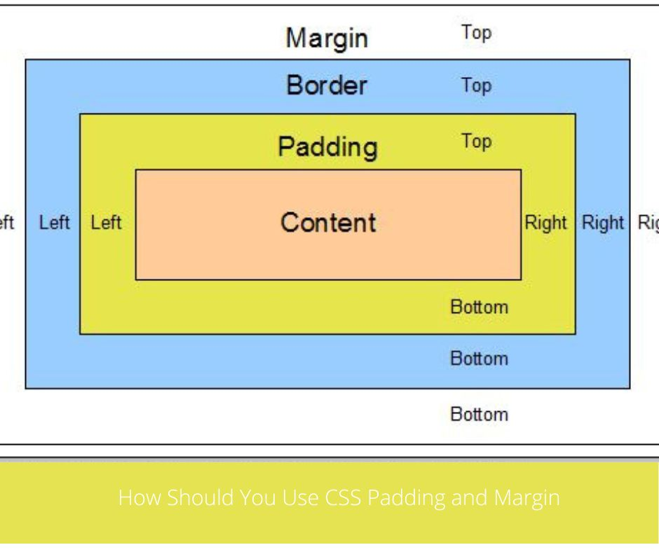
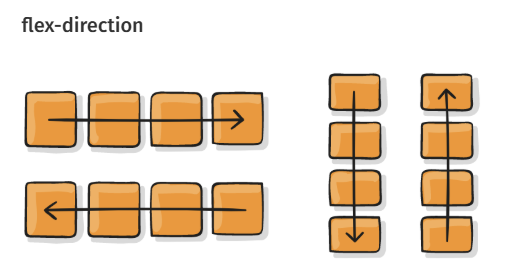
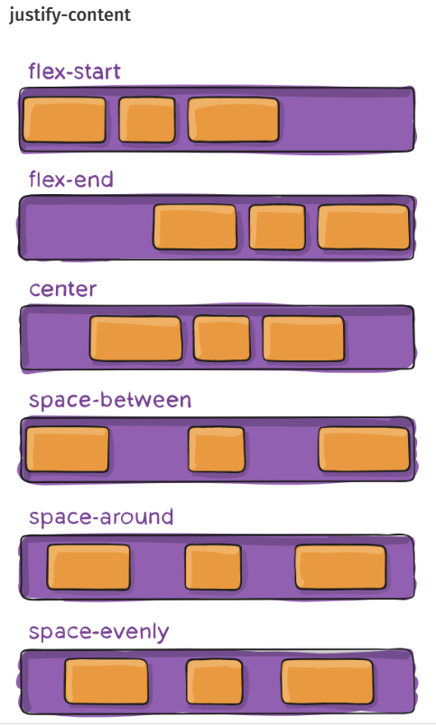
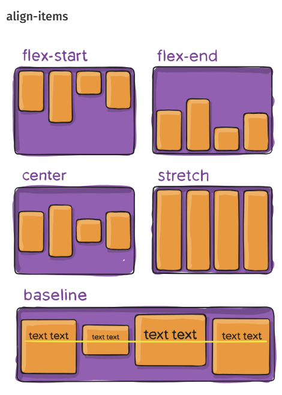
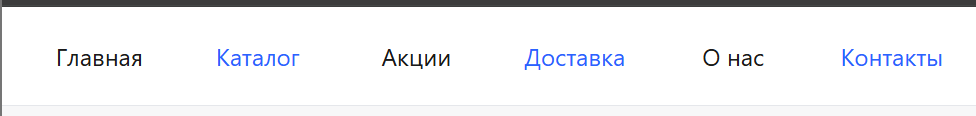
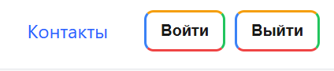
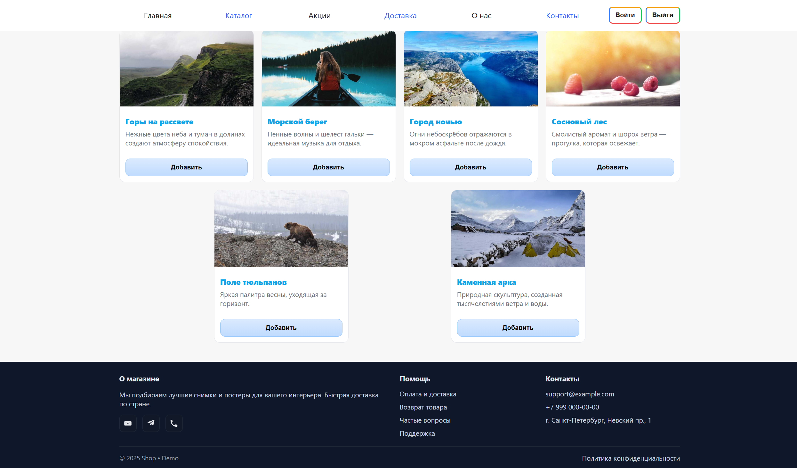

# CSS начало

Самое первое, что нужно сделать, — сообщить HTML-документу, что у нас есть некоторые правила CSS, которые мы хотим использовать. Существует три различных способа применения CSS к документу HTML, с которым вы обычно сталкиваетесь, однако сейчас мы рассмотрим наиболее обычный и полезный способ сделать это — связать CSS с заголовком вашего документа.

Создайте файл в той же папке, что и документ HTML, и сохраните его как `styles.css`. Расширение `.css` показывает, что это файл CSS.

Чтобы связать styles.css с index.html, добавьте следующую строку где-то внутри `<head>` HTML документа:
```html
<link rel="stylesheet" href="styles.css" />
```

Элемент `<link>` сообщает браузеру, что у нас есть таблица стилей, используя атрибут `rel`, и местоположение этой таблицы стилей в качестве значения атрибута `href`. вы можете проверить, работает ли CSS, добавив правило в `styles.css`.


## Стилизация HTML-элементов
Задаем стилизацию мы путём нацеливания на элемент <b>selector</b> — это селектор, который напрямую соответствует имени элемента HTML. Чтобы нацелиться на все абзацы в документе, вы должны использовать селектор p. Чтобы сделать все абзацы зелёными, вы должны использовать:

```css
p {
  color: green;
}
```
Вы можете выбрать несколько селекторов одновременно, разделив их запятыми. Если я хочу, чтобы все параграфы и все элементы списка были зелёными, моё правило выглядит так:


```css
p,  li {
  color: green;
}
```

## Типы селекторов
Понимание того, какой именно селектор вам нужен, очень помогает подобрать подходящий элемент. Сейчас мы разберём разные виды селекторов.

### Селекторы тегов, классов и идентификаторов
К этой группе относятся селекторы HTML-элементов таких, как `h1`.

```css
h1 {
}
```
К группе относятся и селекторы классов:

```css
.box {
}
```
или селекторы идентификаторов (ID):

```css
#unique {
}
```

### Селекторы атрибутов
Эта группа селекторов позволяет выбирать селекторы, основываясь на наличии у них конкретного атрибута элемента:

```css
a[title] {
}
```

или основываясь на значении атрибута:

```css
a[href="https://example.com"]
{
}
```
https://developer.mozilla.org/ru/docs/Learn_web_development/Core/Styling_basics/Attribute_selectors

### Псевдоклассы, псевдоэлементы
К этой группе относятся псевдоклассы, которые стилизуют определённое состояние элемента. Псевдокласс `:hover`, например, применяет правило, только если на элемент наведён курсор мыши

```css
a:hover {
}
```
К группе ещё относятся псевдоэлементы, которые выбирают определённую часть элемента (вместо целого элемента). Например, `::first-line` всегда выбирает первую строку внутри элемента (абзаца `p` в нашем случае), действуя, как если бы тег span оборачивал первую строку, а затем был стилизован.

https://developer.mozilla.org/ru/docs/Learn_web_development/Core/Styling_basics/Pseudo_classes_and_elements
## Комбинаторы

Есть моменты, когда вы хотите, чтобы что-то выглядело иначе, в зависимости от того, где оно находится в документе. Здесь есть несколько селекторов, которые могут вам помочь. Пусть в нашем документе два элемента `div` — один внутри абзаца, а другой внутри элемента списка. Чтобы выбрать только `div` который вложен в элемент `li`. Я могу использовать селектор под названием descendant combinator (комбинатор-потомок), который просто принимает форму пробела между двумя другими селекторами.

Добавим следующее правило в таблицу стилей.
```css
li div {
  color: rebeccapurple;
}
```
Этот селектор выберет любой элемент `div`, который находится внутри (потомка) `li`. Итак, в вашем примере документа вы должны найти, что `div` в третьем элементе списка теперь фиолетовый, но тот, который находится внутри абзаца, не изменился.

Ещё можно попробовать стилизовать абзац, когда он идёт сразу после заголовка на том же уровне иерархии в HTML. Для этого поместите + (соседний братский комбинатор) между селекторами.

Попробуем также добавить это правило в таблицу стилей:

```css
h1 + p {
  font-size: 200%;
}
```
Еще примеры
<ul>
    <li> Дочерний комбинатор (>) помещается между двумя селекторами CSS. При этом будут выбраны только те элементы, соответствующие второму селектору, которые являются прямыми потомками элементов, соответствующих первому селектору. Все элементы-потомки на более низких уровнях иерархии будут пропущены.</li>
    <li>
    Если вы хотите выбрать родственные элементы, даже если они не являются непосредственными соседями, то вы можете использовать общий родственный комбинатор (~). 
    </li>
</ul>

https://developer.mozilla.org/ru/docs/Learn_web_development/Core/Styling_basics/Combinators

## Внешние, внутренние отступы и рамки

https://developer.mozilla.org/ru/docs/Learn_web_development/Core/Styling_basics/Box_model#внешние_внутренние_отступы_и_рамки



###  Внешний отступ (Margin)

Внешний отступ — это невидимое пространство вокруг вашего элемента. Оно отталкивает другие элементы от него. Внешний отступ может быть как положительным, так и отрицательным. Негативное значение может привести к перекрытию некоторых элементов страницы.

Мы можем контролировать все поля элемента сразу, используя свойство `margin`, или каждую сторону индивидуально, используя эквивалентные полные свойства:
```css
margin-top
margin-right
margin-bottom
margin-left
```

### Рамка
Рамка располагается между `margin` и `padding` блочного элемента. Для стилизации рамок существует большое количество различных свойств: четыре рамки, и каждая из них имеет свой стиль, ширину и цвет, которыми мы можем манипулировать. Вы можете установить ширину, стиль или цвет всех четырёх рамок сразу, используя свойство `border`.

Чтобы установить индивидуальные свойства для каждой из четырёх сторон, вы можете использовать:
```css
border-top
border-right
border-bottom
border-left
```
Для установки ширины, стиля или цвета всех рамок используйте:
```css
border-width
border-style
border-color
```

### Внутренний отступ (Padding)

Внутренний отступ расположен между рамкой и областью контента блока. В отличие от внешних отступов (`margin`), вы не можете использовать отрицательные значения для `padding`: они должны быть положительными или равными 0. Любой применённый к вашим элементам фон будет отображаться под областью `padding`, поэтому внутренний отступ обычно используется, чтобы отодвинуть контент от рамок.

Вы можете контролировать значение `padding` для всех сторон элемента, используя свойство `padding`, или для каждой стороны индивидуально, используя следующие полные свойства:
```css
padding-top
padding-right
padding-bottom
padding-left
```

## Flex - контейнер


```css
.container {
  flex-direction: row | row-reverse | column | column-reverse;
}
```

Устанавливает основную ось, таким образом определяя направление flex элементов, помещаемых в flex контейнер.



```css
.container {
  justify-content: flex-start | flex-end | center | space-between | space-around | space-evenly | start | end | left | right;
}
```
Это свойство определяет выравнивание вдоль главной оси. Оно помогает распределить дополнительный остаток свободного пространства, когда-либо все flex элементы в строке негибкие, либо гибкие, но достигли своего максимального размера.


```css
.container {
  align-items: stretch | flex-start | flex-end | center | baseline | first baseline | last baseline | start | end | self-start | self-end + ... safe | unsafe;
}
```
Это свойство определяет поведение по умолчанию того, как flex элементы располагаются вдоль поперечной оси на текущей линии. Думайте об этом как о `justify-content` версии для поперечной оси (перпендикулярной главной оси).

https://habr.com/ru/articles/467049/


# Задачи
0. Создайте `index.html` и `index.css`, подключите CSS файл.
1. Создайте меню, располагающееся сверху страницы, которое должно иметь 6 опций, каждое четное при этом синего цвета и все элементы распределены равномерно по ширине экрана.
Пример:\

2. Добавьте рядом с меню в правый угол две кнопки - войти/выйти. Стилизуйте их, добавив рамку (разную по всем четырем сторонам). Используйте псевдокласс для создания анимации на ваш выбор. Пример:\

3. Создайте основной контент страницы, состоящий из карточек элементов. Каждая карточка должна содержать картинку, название картинки снизу жирным и выделенным цветом, затем небольшое описание ниже серым.
4. Расположите карточки из предыдущего задания равномерно по странице. Задайте свойство переноса контента на следующую строку, если он не будет помещаться.
5. Внутри каждой карточки добавьте кнопку "добавить". Стилизуйте ее на свое усмотрение.
6. Сделайте футор страницы. Разместите туда информацию для связи с ссылками при нажатии на иконки элементов связи. Возьмите за основу футор любого известного сайта для покупок и стилизуйте похожим образом.  



